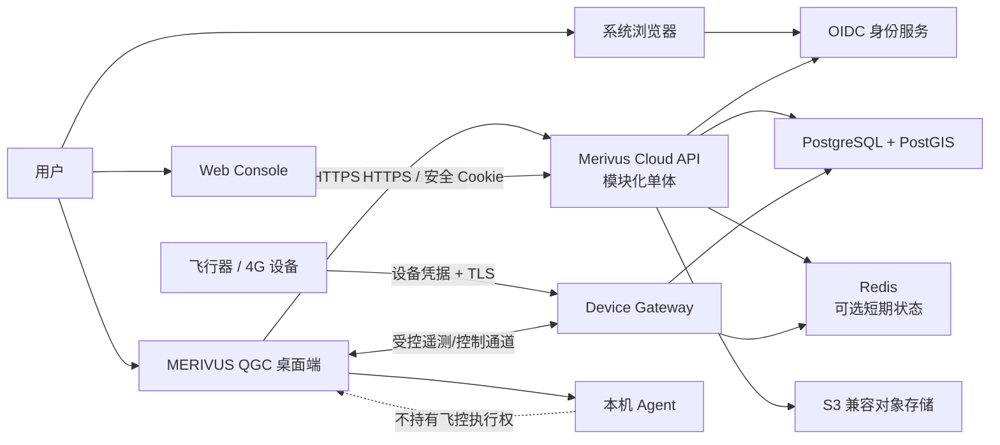
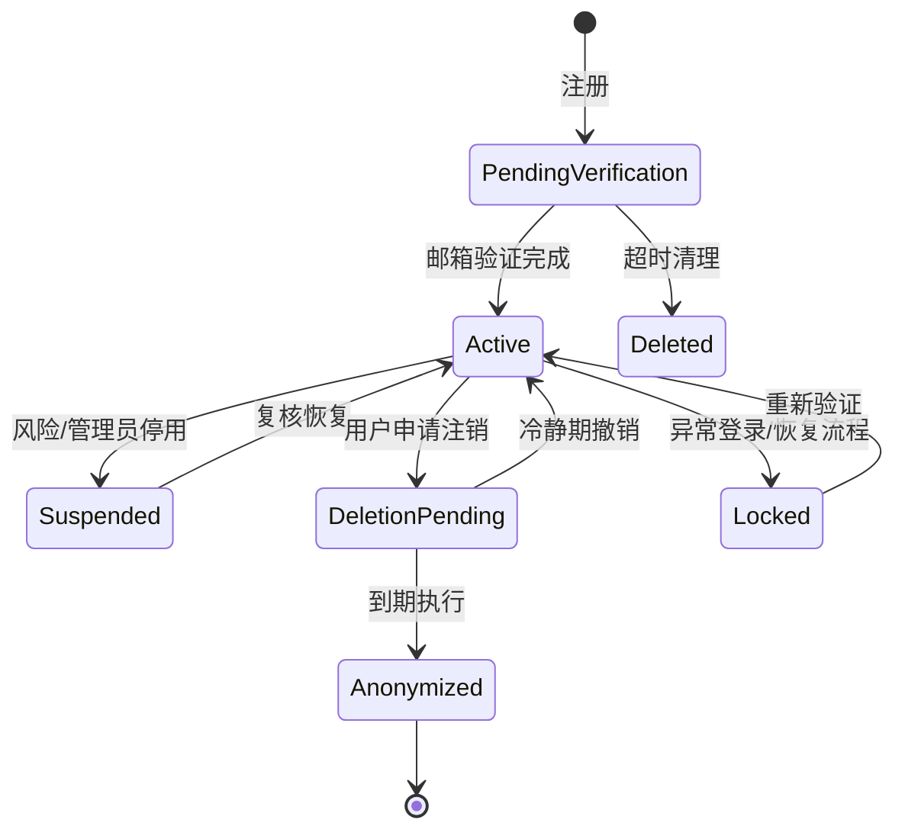
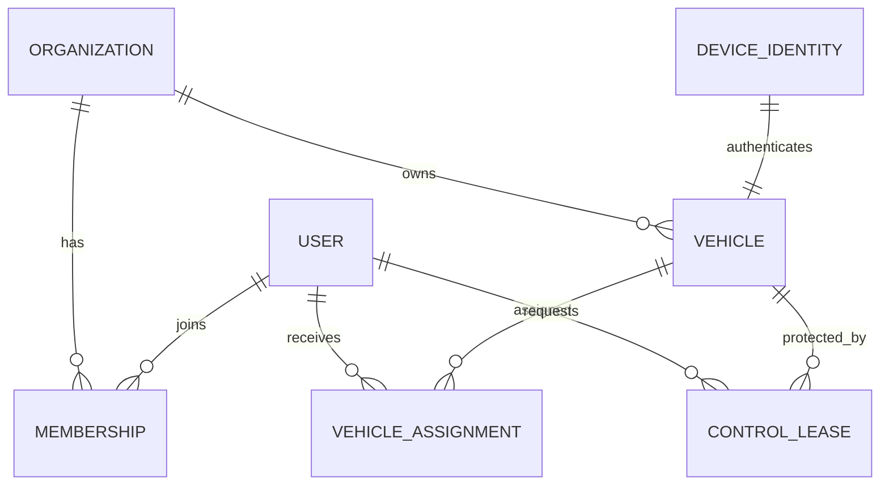

# MERIVUS 账号体系与云端后端工程设计

> 文档状态：目标设计，尚未实现
>
> 编制日期：2026-08-19
>
> 适用范围：MERIVUS GroundStation、未来 Web Console、Cloud API、Device Gateway、GIS/地图资产服务
>
> 当前基线：仓库内尚无生产账号、Cloud API、业务数据库或 Web Console；本机 Agent 的 `X-Merivus-Token` 只保护本机进程通信，不是用户登录系统。

本文面向学过 SQLite、但尚未完整建设过互联网后端的开发者。它既说明“服务器到底由什么组成”，也给出可以拆成 Epic、接口和数据库迁移的目标契约。文中的组件选择是推荐基线，不代表已经完成采购、部署或合规评估。

## 1. 一页结论

### 1.1 推荐方案

第一版采用以下组合：

| 层 | 推荐 | 责任 |
| --- | --- | --- |
| 身份服务 | 成熟 OIDC/OAuth 2.0 身份提供方；自托管优先评估 Keycloak | 注册、登录、邮箱验证、找回密码、MFA、会话、令牌、账号安全后台 |
| 业务后端 | Python + FastAPI 的模块化单体，放在独立 `MerivusPlatform` 仓库 | 用户资料、组织、权限、飞行器、个人设置、任务、地图元数据、审计 |
| 主数据库 | PostgreSQL + PostGIS | 强一致业务数据、关系约束、空间查询、迁移和备份 |
| 临时状态 | Redis，第一阶段可延后 | 限流、在线状态、短时缓存、带 TTL 的控制权租约；不得成为永久事实源 |
| 大文件 | S3 兼容对象存储 | 3D Tiles、DEM/DSM、GeoTIFF、日志、视频、缩略图和导出包 |
| 桌面本地库 | SQLite | 非敏感缓存、离线快照、同步队列、本机设置；不保存明文密码或长期令牌 |
| 设备接入 | 独立 Device Gateway | 设备认证、心跳、遥测路由、控制通道；与普通用户 HTTP API 隔离 |
| 边缘入口 | HTTPS 反向代理/负载均衡器 | TLS、域名、请求大小限制、基础限流、路由 |

身份服务不要与业务用户表混成一套自制登录代码。身份服务回答“这个人是谁”；业务后端回答“他属于哪个组织、可以访问哪架飞机、能做什么”；QGC 本地安全层最终回答“此刻这条飞行动作是否允许执行”。

### 1.2 五个必须长期成立的不变量

1. **用户登录成功不等于获得飞控权。** 账号权限、飞行器归属、当次控制权租约和 QGC 本地飞行前置检查缺一不可。
2. **飞行器不直接属于一个自然人字段。** 飞行器归属组织，用户通过组织成员关系和可撤销的分配关系获得查看或操作权限。
3. **云端故障不能使本地安全功能失效。** 已连接飞行器的人工安全操作、告警和返航等既有本地能力不能依赖 Cloud API 在线。
4. **数据库不存大地图文件。** PostgreSQL 保存可查询的元数据、边界和对象键；3D Tiles、栅格、日志和视频保存在对象存储。
5. **权限在服务端强制执行。** 隐藏按钮只是体验优化，不能替代 API 授权、租户隔离、数据库约束和审计。

### 1.3 第一版明确不做

- 不在 QML 中直接收集密码并调用“用户名/密码换 Token”接口。
- 不自行实现 OAuth、JWT 签名、MFA、密码重置令牌或邮件验证码算法。
- 不以 MAVLink `sysid` 作为全球唯一飞行器身份。
- 不把每个 MAVLink 包永久写入主业务表。
- 不把 Redis 当账号、权限、任务或审计的唯一存储。
- 不以 3D Tiles 的可视化结果直接判定航线安全。
- 不在第一版拆十几个微服务；身份服务和 Device Gateway 因安全边界独立，其余业务先保持模块化单体。

## 2. 先理解服务器后端的几个概念

### 2.1 客户端、API 服务与数据库

- **地面站客户端**：用户电脑上的 QGC Custom Build。它显示界面、保存少量本地缓存，通过 HTTPS 调用服务器。
- **API 服务**：长期运行的后端程序。它验证令牌、检查权限、执行业务规则，再读写数据库。
- **数据库**：只允许后端通过内网连接。客户端绝不能直接拿数据库账号连 PostgreSQL。
- **身份服务**：专门完成登录认证并签发令牌。业务后端信任其公钥和发行者配置，但仍自行检查业务权限。
- **对象存储**：像按键名寻址的文件仓库，适合大文件；数据库只保存对象键、哈希、大小和权限元数据。

SQLite 是嵌入式数据库：应用进程直接读写一个文件。PostgreSQL 是客户端/服务器数据库：独立数据库进程统一处理网络连接、并发事务、权限和恢复。SQLite 官方明确说明同一数据库只有一个写者；面对多个网络客户端和并发写入，应选择客户端/服务器数据库。因此 SQLite 很适合地面站本机缓存，不适合作为多用户生产主库。[SQLite：适用场景](https://www.sqlite.org/whentouse.html)

### 2.2 认证、授权、归属与控制权

| 概念 | 问题 | 示例 |
| --- | --- | --- |
| 认证 Authentication | 你是谁？ | OIDC 登录后身份是 `user_123` |
| 授权 Authorization | 你通常能做什么？ | 是组织 A 的调度员，可创建任务 |
| 资源归属 Ownership | 资源属于谁管理？ | UAV-7 属于组织 A，不属于某次登录会话 |
| 资源分配 Assignment | 当前把资源交给谁使用？ | UAV-7 分配给飞手甲，有效到今晚 |
| 控制权租约 Control lease | 此刻谁可发控制动作？ | 工作站 W 在 30 秒租约内持有 UAV-7 控制权 |
| 本地安全门 | 此刻动作是否安全？ | QGC 根据连接、定位、模式、确认状态拒绝起飞 |

这五层必须分开建模。任何单一的 `owner_user_id`、`is_admin` 或“已登录”判断都不足以保护多机调度。

## 3. 目标架构



### 3.1 为什么先做模块化单体

账号、组织、飞行器、设置、地图和任务之间有大量事务关系。早期把它们拆成微服务会立刻引入分布式事务、消息一致性、服务发现、跨服务鉴权和多套部署。第一版将它们放进一个可清晰分模块的 API 进程和一个 PostgreSQL 数据库，可以用数据库事务保证一致性。

以下边界应从一开始独立：

- **身份服务**：使用标准协议，避免业务代码接触密码和复杂登录流程。
- **Device Gateway**：长连接、设备凭据、MAVLink/遥测与公网攻击面不同于普通 REST API。
- **对象存储**：大文件生命周期与事务数据不同。
- **本机 Agent**：保持现有 loopback 与“只产生建议”边界，不承担云端认证服务器职责。

业务后端内部建议模块：

```text
src/
  identity_adapter/   # OIDC claims 映射、令牌验证；不保存密码
  accounts/           # 业务用户资料、账号状态镜像
  organizations/      # 组织、成员、邀请
  authorization/      # 权限决策与策略
  vehicles/           # 飞行器注册、归属、分配
  control_leases/     # 控制权租约和冲突处理
  preferences/        # 用户/设备/组织设置与同步
  missions/           # 任务草稿、版本和发布
  map_assets/         # 地图资产目录、边界、版本、访问授权
  audit/              # 不可静默修改的审计事件
  notifications/      # 邮件、站内通知、设备安全告警
  common/             # 配置、事务、错误、时间、ID
```

模块只能通过公开服务接口协作；禁止任意跨模块直接修改表。数据库迁移必须由唯一迁移工具按版本顺序执行，禁止服务器手改表结构。

Cloud API 建议使用 Python/FastAPI，是因为项目已经具备 Python/FastAPI 的本机 Agent 经验，便于复用开发与测试知识；两者仍是不同进程、不同信任域和不同部署产物，不能把本机 Agent 直接扩成公网账号服务器。后端独立仓库也能避免服务器依赖、容器和数据库迁移混入 QGC/PX4 的构建生命周期。身份服务应使用自己的数据库或独立 schema 与数据库账号，不直接读写业务表。

## 4. 身份与登录设计

### 4.1 选择 OIDC，而不是自制登录协议

OAuth 2.0 主要解决授权，OpenID Connect 在其上定义用户认证。桌面地面站是不能安全保守 `client_secret` 的 **public native client**。推荐流程是：

1. QGC 生成一次性的 PKCE `code_verifier`、`code_challenge` 和 `state`。
2. QGC 打开系统默认浏览器，跳转身份服务登录页。
3. 用户只在身份服务页面输入密码、MFA 或 Passkey。
4. 身份服务重定向到临时的 `http://127.0.0.1:{随机端口}/callback`。
5. QGC 校验 `state`，用授权码和 `code_verifier` 换取令牌。
6. QGC 将短期 access token 放内存，将 refresh token 放操作系统凭据库。

[RFC 8252](https://www.rfc-editor.org/rfc/rfc8252.html) 要求原生应用使用外部浏览器并采用 PKCE；[OAuth 2.0 Security BCP（RFC 9700）](https://www.rfc-editor.org/rfc/rfc9700.html) 要求 public client 使用 PKCE，并要求 refresh token 使用发送方约束或轮换。不得采用隐式流，也不得采用让 QGC 直接收集密码的 Resource Owner Password Credentials/Direct Grant。

### 4.2 身份服务推荐边界

推荐优先评估自托管 Keycloak，也可以替换为满足相同 OIDC 契约的合规托管服务。Keycloak 官方能力覆盖自助注册、邮箱验证、忘记密码、TOTP/Passkey/恢复码、账号控制台、管理后台和 step-up authentication。[Keycloak Server Administration Guide](https://www.keycloak.org/docs/latest/server_admin/)；[Keycloak OIDC 指南](https://www.keycloak.org/securing-apps/oidc-layers)

业务数据库只保存：

- `identity_subject`：OIDC `iss + sub` 的稳定组合；
- 昵称、头像键、语言等业务资料；
- 组织成员关系、权限、资源关系；
- 账号停用、业务注销和数据保留状态。

业务数据库不保存：

- 密码明文、可逆密码、密码提示问题；
- TOTP 种子、Passkey 私钥；
- 身份服务管理账号密码；
- refresh token 明文。

第一版建议使用“邮箱验证 + 密码/Passkey”，手机号登录等确有业务和短信风控能力后再增加。邮箱、手机号和昵称都可能变化，不能作为业务外键；唯一稳定关联必须是 `issuer + subject`。昵称可以重复，登录标识的规范化、唯一性、验证状态和变更流程由身份服务维护。除非业务确实需要，不要为了“常规登录系统看起来完整”而强制收集真实姓名、身份证或手机号。

### 4.3 账号生命周期



必须覆盖这些流程：

- 注册、邮箱所有权验证、重复邮箱处理；
- 登录、退出当前设备、退出所有设备；
- 忘记密码、修改密码、邮箱变更；
- 绑定/解绑 MFA、生成与轮换恢复码；
- 查看活跃会话和最近安全事件；
- 账号停用、申诉恢复、用户主动注销；
- 组织邀请、接受/拒绝、成员移除；
- 管理员操作留痕，禁止无审计“代登录”。

注销时区分“个人资料”和“组织业务记录”：可删除或匿名化个人资料，但已发布任务、飞行安全记录、资产变更和审计不能因个人注销而失去可追溯性；这类记录应按合法目的、保留期和最小化原则保留稳定的匿名主体标识。组织管理员离职前必须完成组织所有权和关键资源交接，不能把组织资源级联删除。

所有注册、登录和找回页面的“账号不存在”“密码错误”等外部反馈使用一致文案和近似时延，详细原因只写安全日志，降低账号枚举风险。邮件验证码和重置链接必须单次使用、短期有效、只保存摘要，并限制发送频率。

### 4.4 密码和 MFA 基线

若身份服务启用密码：

- 单因素密码最少 15 个字符；若密码只作为 MFA 的一个因素，可允许最少 8 个字符；至少允许 64 个字符。
- 允许空格、Unicode 和密码管理器粘贴，不设置“必须大写+数字+符号”的组合规则。
- 与常见、上下文相关和已泄露密码阻止列表比较。
- 不要求无原因的周期改密；仅在泄露、风险或认证器变化时强制变更。
- 登录失败按账号、IP、设备和风险信号分层限流；避免简单永久锁死造成拒绝服务。
- 调度员、飞手、组织管理员和平台管理员必须启用 MFA；高风险管理和控制权变更要求 step-up authentication。
- 优先提供 Passkey/WebAuthn 这类抗钓鱼方式；TOTP 可作兼容方案，但不是抗钓鱼认证器。

这些规则来自 [NIST SP 800-63B-4](https://pages.nist.gov/800-63-4/sp800-63b.html)；NIST 对 AAL2 要求双因素并提供至少一种抗钓鱼选项。[AAL2 要求](https://pages.nist.gov/800-63-4/sp800-63b/aal/)

若不得不临时自行验证密码，应使用成熟库和 Argon2id，不得使用 MD5、SHA-1 或普通 SHA-256。OWASP 当前最低建议为 Argon2id 19 MiB 内存、2 次迭代、并行度 1，并应按服务器基准逐步提高；pepper 应存放在数据库之外的密钥管理系统。[OWASP Password Storage Cheat Sheet](https://cheatsheetseries.owasp.org/cheatsheets/Password_Storage_Cheat_Sheet.html) 但本项目仍首选让身份服务承担密码库。

### 4.5 令牌与本机保存

| 项目 | 建议 |
| --- | --- |
| Access token | 5～15 分钟；仅内存；校验 `iss`、`aud`、签名、过期、允许算法和最小 scope |
| Refresh token | 轮换；有最大寿命和空闲寿命；只放 OS 凭据库；重放时撤销整条 token family |
| ID token | 只用于客户端登录结果；不能当业务 API 权限凭证 |
| Web Console 会话 | 优先 BFF + `Secure`、`HttpOnly`、合适 `SameSite` 的 Cookie；不放 URL 或 localStorage |
| 服务账号 | 独立 client credentials/私钥；不得冒充普通用户；权限最小化 |

Windows 使用 Credential Manager/DPAPI，macOS 使用 Keychain，Linux 使用 Secret Service。Qt 端应封装 `CredentialStore` 接口；`QSettings`、日志、崩溃转储和普通 SQLite 均不得出现长期令牌。OWASP 指出会话令牌在会话期间等价于最强认证器，并强调全程 TLS 与安全会话存储。[OWASP Session Management Cheat Sheet](https://cheatsheetseries.owasp.org/cheatsheets/Session_Management_Cheat_Sheet.html)

## 5. 组织、角色与权限

### 5.1 多租户模型

第一版使用共享数据库、共享表、每个业务资源都带 `organization_id`。后端在每个请求建立明确的组织上下文；资源 ID 即使被猜中，也必须再次验证组织和权限。

权限判定表达式：

```text
允许 = 账号有效
   AND 组织成员有效
   AND 角色包含动作权限
   AND 资源属于该组织
   AND 用户拥有所需分配关系
   AND 当前条件满足（MFA、控制租约、设备状态、时间窗）
   AND 未被更高优先级安全策略禁止
```

PostgreSQL Row-Level Security 可作为第二道租户隔离防线；开启后没有匹配 policy 时默认拒绝。但表所有者和 `BYPASSRLS` 角色通常可绕过，因此应用运行账号不得是表所有者或超级用户，RLS 也不能代替应用授权测试。[PostgreSQL Row Security](https://www.postgresql.org/docs/current/ddl-rowsecurity.html)

令牌中只放稳定、粗粒度的身份和 scope，不放会频繁变化的飞行器分配、控制租约或完整角色矩阵。后端每次访问资源都查询或短期缓存当前业务权限；成员被移除、账号被停用或飞行器被转移后，即使旧 access token 尚未自然过期，业务检查也应立即拒绝。

### 5.2 建议角色矩阵

| 权限 | Owner | Admin | Dispatcher | Operator | Observer | Auditor |
| --- | :---: | :---: | :---: | :---: | :---: | :---: |
| 管理组织与账单 | ✓ | 受限 |  |  |  | 只读 |
| 邀请/移除成员 | ✓ | ✓ |  |  |  | 只读 |
| 注册/退役飞行器 | ✓ | ✓ | 受限 |  |  | 只读 |
| 分配飞行器 | ✓ | ✓ | ✓ |  |  | 只读 |
| 查看遥测与地图 | ✓ | ✓ | ✓ | ✓ | ✓ | 按范围 |
| 创建任务草稿 | ✓ | ✓ | ✓ | ✓ |  | 只读 |
| 批准/发布任务 | ✓ | ✓ | ✓ | 可配置 |  | 只读 |
| 申请控制租约 | ✓ | ✓ | ✓ | ✓ |  | 只读 |
| 导出日志/敏感坐标 | ✓ | ✓ | 受限 | 受限 |  | 按审计授权 |
| 查看审计 | ✓ | ✓ | 受限 | 本人 |  | ✓ |

角色只是权限集合，不在代码中到处判断 `role == admin`。权限使用稳定枚举，例如 `vehicle.read`、`vehicle.assign`、`mission.publish`、`map_asset.export`、`control_lease.acquire`。平台超级管理员与租户管理员必须完全分离。

## 6. 飞行器身份、归属、连接与控制

### 6.1 稳定身份

飞行器至少有三种 ID：

- `vehicle_id`：平台生成的 UUID，业务主键，永不复用；
- `hardware_uid`/设备证书主体：设备注册和认证身份；
- `mavlink_system_id`：某条链路中的 1～255 地址，只能作为连接属性，不能作为平台主键。

设备注册建议采用一次性、短期、可撤销的 enrollment code：管理员在后台创建注册码，现场受信客户端扫描/输入，设备生成自己的密钥对，服务器签发设备证书或绑定公钥。长期设备私钥不从服务器下载到多台设备，不提交仓库。

MAVLink 2 signing 可以验证消息来自持有共享密钥的可信来源，但它不是用户登录、组织授权或完整的链路加密替代品。[MAVLink Message Signing](https://mavlink.io/en/guide/message_signing.html) Device Gateway 的公网链路仍应使用 TLS/VPN 和独立设备身份。

### 6.2 资源关系



- **归属**：`vehicle.organization_id`，转移必须双边确认、step-up MFA、审计和冷静期。
- **分配**：用户在时间窗内拥有查看、规划或操作范围，可随时撤销。
- **连接**：网关观测到的临时状态，不改变归属。
- **控制租约**：短 TTL、单飞行器至多一个有效持有者；续租失败时到期释放。

### 6.3 控制租约不是飞行安全授权

获取租约前检查权限、MFA 新鲜度、工作站身份、已有持有者和租约版本。服务端用原子 compare-and-set 发放；每次续租携带 `lease_id + fencing_token`，旧持有者即使网络延迟恢复也会因较小 fencing token 被拒绝。

租约只决定哪个工作站可尝试发控制命令。未来接入真实动作时，还必须经过 QGC 本地 Schema、Policy、人工确认、飞行器状态检查和审计；当前 AI 链路只有 Schema/Policy 和建议展示，统一确认与 Executor 尚未实现，因此本设计不得被解释为它们已经接通。云端不得向 LLM/Agent 暴露通用 MAVLink 接口。

## 7. “不同账号的记忆”与设置同步

### 7.1 先给设置分类

| 层级 | 示例 | 是否云同步 | 覆盖优先级 |
| --- | --- | --- | --- |
| 平台强制策略 | 最低安全规则、禁止能力 | 是 | 最高且用户不可覆盖 |
| 组织策略 | 默认地图源、允许区域、审计周期 | 是 | 高 |
| 用户偏好 | 主题、单位、常用视图、告警展示 | 是 | 中 |
| 工作站本机 | 窗口位置、本地串口、视频解码器 | 默认否 | 中低 |
| 会话临时 | 当前选中飞行器、面板展开状态 | 可选 | 最低，退出可丢弃 |

飞控参数、地理围栏、指令白名单、控制租约、设备密钥绝不能伪装成“个人偏好”。

### 7.2 设置数据模型

通用 UI 偏好可用带 schema 的键值记录：

```json
{
  "namespace": "map.display",
  "key": "default_layer",
  "value": {"provider": "esri", "style": "satellite"},
  "schema_version": 2,
  "revision": 17,
  "updated_at": "2026-08-19T08:00:00Z"
}
```

重要设置应建专用强类型表，不要把所有事实塞入一列 JSON。每个键必须有允许类型、大小、默认值、敏感级别、同步范围和迁移函数。服务端返回 `ETag/revision`，客户端更新时携带 `If-Match`；版本冲突返回 `409/412`，不能静默覆盖。

### 7.3 本地 SQLite 的职责

建议本地库分表：

- `cached_user_profile`：最小资料快照；
- `cached_preferences`：服务器设置副本和 revision；
- `local_preferences`：只属于本机的设置；
- `cached_vehicle_catalog`：已授权飞行器的最小只读目录；
- `sync_outbox`：离线产生、待同步的低风险变更；
- `sync_cursor`：各资源最后同步游标；
- `cache_manifest`：地图/缩略图缓存键、哈希、过期时间。

不保存密码、MFA 种子、设备私钥、对象存储永久凭据或无限期的 access token。含敏感坐标的离线数据必须最小化、设置有效期和一键清除；确需落盘加密时评估 SQLCipher/操作系统加密能力及许可证，不要把“文件在用户目录”当作加密。

### 7.4 离线行为

- 未登录且无本地会话：允许进入受限本地模式，保持安全告警、已有直连和人工应急能力；不显示其他账号的云资源。
- 云端短暂不可用：使用上次授权的只读快照；高风险云端变更、成员管理和归属转移禁用。
- access token 过期但 refresh 失败：不伪造在线身份；明确显示“云端会话失效”。
- 离线偏好：可以进入 outbox；组织权限、控制租约和飞行任务发布不得离线排队后自动执行。
- 换账号：先清理前一账号的内存、令牌句柄和账号缓存，再加载新账号命名空间。

## 8. 数据存储设计

### 8.1 数据放在哪里

| 数据 | PostgreSQL/PostGIS | 对象存储 | Redis | 客户端 SQLite |
| --- | :---: | :---: | :---: | :---: |
| 用户业务资料、组织、权限 | ✓ |  | 缓存可选 | 最小快照 |
| 密码/MFA | 身份服务专库 |  |  | 禁止 |
| 飞行器目录、分配、任务版本 | ✓ | 附件 | 热缓存 | 授权快照 |
| 禁飞区、航线边界、空间索引 | ✓ PostGIS | 原始数据包 | 查询缓存 | 必要切片 |
| 3D Tiles、GeoTIFF、DEM/DSM | 元数据/边界 | ✓ |  | 受控缓存 |
| 遥测最新状态 | 可持久化摘要 |  | ✓ | 当前会话 |
| 遥测历史 | 分区表/后续时序库 | 批量归档 |  | 短期 |
| 视频、ULog、导出包 | 元数据 | ✓ |  | 按需下载 |
| 审计事件 | ✓ 追加写 | 冷归档 |  | 不作为真相源 |

PostGIS 的 `geometry` 适合指定投影下的局部高性能计算，`geography` 适合经纬度和球面距离；必须显式记录 SRID、垂直基准、单位、数据来源、采集时间和精度。[PostGIS Data Management](https://postgis.net/docs/using_postgis_dbmanagement.html) 大数据空间查询需 GiST/BRIN 等空间索引。[PostGIS Spatial Indexes](https://postgis.net/docs/postgis-en.html#build-indexes)

3D Tiles 是为大规模 3D 地理内容流式传输和渲染设计的分层格式，适合对象存储/CDN，不等于经过验证的碰撞计算模型。[OGC 3D Tiles 1.1](https://www.ogc.org/standards/3dtiles/)

### 8.2 核心关系表草案

所有时间使用 UTC `timestamptz`；业务 ID 使用 UUID；邮箱比较使用规范化列或不区分大小写索引；表中省略通用 `created_at/updated_at` 时仍必须实际存在。

```text
app_user(
  id PK, identity_issuer, identity_subject,
  display_name, avatar_object_key, locale, timezone,
  status, deletion_requested_at,
  UNIQUE(identity_issuer, identity_subject)
)

organization(id PK, name, status, policy_version)
membership(id PK, organization_id FK, user_id FK, role_id FK,
           status, valid_from, valid_until,
           UNIQUE(organization_id, user_id))
role(id PK, organization_id NULLABLE, name)
role_permission(role_id FK, permission_code, PRIMARY KEY(role_id, permission_code))

vehicle(id PK, organization_id FK, display_name, serial_number,
        lifecycle_status, model, current_config_revision)
device_identity(id PK, vehicle_id FK UNIQUE, credential_fingerprint UNIQUE,
                status, issued_at, expires_at, revoked_at)
vehicle_assignment(id PK, organization_id FK, vehicle_id FK, user_id FK,
                   permission_set, valid_from, valid_until, revoked_at)
vehicle_connection(id PK, vehicle_id FK, gateway_id, connection_instance_id,
                   mavlink_system_id, connected_at, last_seen_at, disconnected_at)
control_lease(id PK, vehicle_id FK, holder_user_id FK, workstation_id,
              fencing_token, status, acquired_at, expires_at, released_at)

user_preference(id PK, user_id FK, namespace, key, value_json,
                schema_version, revision,
                UNIQUE(user_id, namespace, key))
workstation(id PK, user_id FK, installation_id, display_name,
            public_key, trust_status, last_seen_at)

mission(id PK, organization_id FK, created_by FK, status, current_revision_id)
mission_revision(id PK, mission_id FK, revision_no, content_json,
                 content_sha256, created_by FK,
                 UNIQUE(mission_id, revision_no))

map_asset(id PK, organization_id NULLABLE, name, asset_type, object_key,
          sha256, byte_size, content_type, version, status,
          horizontal_srid, vertical_datum, accuracy_m,
          captured_at, source, license_code, bbox geometry,
          UNIQUE(organization_id, object_key, version))

audit_event(id PK, occurred_at, organization_id, actor_type, actor_id,
            action, resource_type, resource_id, outcome,
            request_id, workstation_id, source_ip_hash,
            before_digest, after_digest, metadata_json)
```

必须增加的约束：

- 同一飞行器最多一个有效控制租约，可用排他约束、事务锁或专用租约算法保证；
- 所有关联资源的 `organization_id` 必须一致，不能只靠调用方传值；
- 分配结束时间晚于开始时间；证书撤销后不能恢复为同一凭据；
- 任务 revision 只追加，不原地覆盖已发布内容；
- 对象入库前校验 SHA-256、媒体类型、大小、恶意内容和授权范围；
- 审计表禁止业务用户 UPDATE/DELETE，归档和保留由专用受控作业执行。

### 8.3 遥测与高频数据

不要让数据库写入阻塞控制链路。Gateway 先维持连接和安全路由，再异步产生标准化遥测事件。第一版保存：

- `vehicle_latest_state`：每机最新快照，可重建；
- `telemetry_sample`：按时间分区的降采样关键状态；
- `flight_session`：一次飞行的开始、结束、操作者和版本；
- 原始日志：分段写对象存储，数据库记录哈希和索引。

PostgreSQL 原生声明式分区适合按月/日拆分较大的时间表，并方便按保留策略 detach/归档。[PostgreSQL Partitioning](https://www.postgresql.org/docs/current/ddl-partitioning.html) 只有真实负载证明需要时，再引入 TimescaleDB、Kafka 或专用时序数据库。

## 9. API 契约

### 9.1 通用约定

- 路径前缀 `/api/v1`，通过兼容变更演进；破坏性变更才升主版本。
- 使用 OpenAPI 3.1 描述，服务端与客户端模型由同一契约生成或校验。[OpenAPI 3.1.1](https://spec.openapis.org/oas/v3.1.1.html)
- JSON 字段使用稳定英文名；面向用户的文案在客户端本地化。
- 错误采用 `application/problem+json`，遵循 [RFC 9457](https://www.rfc-editor.org/rfc/rfc9457.html)，不暴露堆栈、SQL 或账号是否存在。
- 每个请求携带/返回 `X-Request-Id`；创建和关键 POST 支持 `Idempotency-Key`。
- 列表使用游标分页，不用随数据变化漂移明显的超大 offset。
- 更新使用 ETag/`If-Match` 或显式 revision，避免最后写入静默覆盖。
- 只在 TLS 上提供生产 API；数据库、Redis 和对象存储管理端口不暴露公网。

### 9.2 身份服务端点与业务端点分工

身份服务负责 OIDC 标准端点：authorization、token、JWKS、userinfo、logout、注册和恢复页面。业务 API 不再重复提供 `/login` 和 `/password/reset`。

业务 API 第一批：

```text
GET    /api/v1/me
PATCH  /api/v1/me
GET    /api/v1/me/preferences
PUT    /api/v1/me/preferences/{namespace}/{key}
DELETE /api/v1/me/preferences/{namespace}/{key}

GET    /api/v1/organizations
GET    /api/v1/organizations/{org_id}/members
POST   /api/v1/organizations/{org_id}/invitations
PATCH  /api/v1/organizations/{org_id}/members/{user_id}

GET    /api/v1/vehicles
POST   /api/v1/vehicles/{vehicle_id}/assignments
DELETE /api/v1/vehicles/{vehicle_id}/assignments/{assignment_id}
GET    /api/v1/vehicles/{vehicle_id}/latest-state
POST   /api/v1/vehicles/{vehicle_id}/control-leases
POST   /api/v1/control-leases/{lease_id}/renew
DELETE /api/v1/control-leases/{lease_id}

GET    /api/v1/map-assets
POST   /api/v1/map-assets/uploads
POST   /api/v1/map-assets/{asset_id}/complete
GET    /api/v1/map-assets/{asset_id}/download-url

POST   /api/v1/missions
POST   /api/v1/missions/{mission_id}/revisions
POST   /api/v1/missions/{mission_id}/publish
GET    /api/v1/audit-events
```

上传采用后端签发的短期、限大小、限媒体类型、绑定对象键的预签名 URL；客户端直传对象存储，完成后后端校验哈希再把资产状态从 `uploading` 改为 `ready`。下载 URL 同样短期有效，不把 bucket 永久公开。

### 9.3 权限错误示例

```json
{
  "type": "https://api.merivus.example/problems/permission-denied",
  "title": "Permission denied",
  "status": 403,
  "detail": "当前账号无权执行此操作。",
  "instance": "urn:request:018f...",
  "code": "permission_denied"
}
```

客户端只根据稳定的 `status/code` 分支，不解析 `detail` 文案。

## 10. 地图、3D 数据与飞行安全数据

地图数据需要区分：

1. **显示资产**：卫星图、倾斜摄影、3D Tiles、纹理，优化目标是可视化和流式加载。
2. **计算资产**：DEM/DSM、建筑物矢量、障碍物、禁飞区、机场、电线等，必须有坐标系、垂直基准、精度和时效。
3. **业务覆盖层**：任务区、客户地块、标注和个人收藏。
4. **敏感数据**：生产坐标、关键设施、真实轨迹和高精度测绘成果，需要更严格授权与保留策略。

每个地图资产必须记录：来源、许可证、覆盖范围、采集时间、更新时间、坐标参考系、垂直基准、分辨率/精度、转换链、处理软件版本、SHA-256 和审批状态。未知精度、未知垂直基准或超出覆盖区时，GIS Safety Service 必须返回 `unknown/warning`，不能判定安全。

公开互联网地图服务、地图数据库和测绘地理信息在中国有专门的资质、审核、服务器位置和数据安全要求。《地图管理条例》规定互联网地图服务相关资质、境内服务器和经审核地图等要求；是否适用于具体的内部地面站、客户部署或公开服务，应在上线前由有资质的测绘与法律专业人员按业务形态确认。[国务院《地图管理条例》](https://www.gov.cn/zhengce/zhengceku/2015-12/14/content_10403.htm)

## 11. 安全设计

### 11.1 威胁清单

| 威胁 | 主要控制 |
| --- | --- |
| 撞库/暴力登录 | MFA、阻止列表、分层限流、风险告警、统一错误 |
| Token 被窃 | 短 access token、refresh 轮换、OS 凭据库、TLS、受众限制、会话撤销 |
| 越权访问他人飞行器 | 服务端 RBAC+关系检查、organization_id、RLS、防 IDOR 测试 |
| 账号接管后执行飞行 | step-up MFA、分配关系、控制租约、工作站绑定、QGC 本地确认与状态检查 |
| 设备伪装/串机 | 唯一设备凭据、证书撤销、网关映射、每连接实例隔离、协议回放测试 |
| 地图/任务被篡改 | 版本化、SHA-256、发布审批、签名清单、审计、不可变原始资产 |
| SQL/命令注入 | 参数化查询、输入 schema、最小数据库权限、禁止 shell 拼接 |
| 恶意文件 | 类型/大小限制、隔离上传、扫描、解压炸弹防护、转码沙箱 |
| 内部管理员滥用 | 职责分离、step-up、双人审批、不可静默删除审计、定期复核 |
| 云服务中断 | 本地安全降级、缓存只读、超时/熔断、备份恢复、故障演练 |

以 [OWASP ASVS 5.0](https://github.com/OWASP/ASVS/releases/tag/v5.0.0_release) 作为后端安全验收清单，至少覆盖输入、认证、会话、访问控制、密码学、日志、数据保护、通信和 API。高风险飞行相关接口按比普通 SaaS 更严格的威胁模型评审。

### 11.2 密钥和配置

- 密钥、数据库密码、SMTP 凭据、OIDC 管理凭据放密钥管理系统，不放 Git、镜像或普通 `.env` 备份。
- 开发、测试、预生产、生产使用不同身份 realm、数据库、bucket、证书和密钥。
- 密钥支持版本、轮换、撤销和最小权限；旧版本只在明确迁移窗内可用。
- 生产数据库应用账号只拥有所需 schema DML；迁移账号、只读报表账号和备份账号分离。
- PostgreSQL 使用 TLS，主机认证优先 SCRAM-SHA-256 或证书，限制来源网段。[PostgreSQL TLS](https://www.postgresql.org/docs/current/ssl-tcp.html)
- 数据库磁盘、备份和对象存储启用静态加密；需要检索的普通业务字段依赖存储层加密与严格访问控制，特别敏感且无需查询的值再采用由密钥管理系统托管密钥的字段级信封加密。加密不能替代最小收集、授权和删除策略。

### 11.3 审计与普通日志分离

普通运行日志用于排障，可按周期清理；审计日志回答“谁在何时、从哪台工作站、对什么资源、尝试做什么、结果如何”。

必须审计：登录安全事件、MFA 和凭据变化、会话撤销、成员/角色变化、飞行器注册/转移/退役、分配变化、控制租约、任务发布、地图资产发布/导出、管理员查看敏感数据、审计导出和保留策略变更。

审计中不记录密码、令牌、MFA 种子、完整 Authorization header、对象存储签名 URL 或无必要的个人信息。关键事件可将顺序摘要链或定期签名清单写入独立存储，以发现事后篡改。

## 12. 中国大陆上线前的合规工作流

本节是工程待办，不是法律意见。上线地域、用户类型、是否公开地图服务、数据精度、客户行业和是否跨境会显著改变要求。

1. 建立数据目录和分类分级：账号资料、设备标识、精确位置、轨迹、地图资产、日志、视频分别标注来源、目的、保留期、访问人和出境情况。
2. 为每种个人信息记录处理目的和法律基础，遵循最小必要；提供查阅、更正、删除、撤回同意和注销入口。
3. 对精确位置、轨迹等高风险数据评估是否属于敏感个人信息或重要数据，采用单独授权、严格访问和影响评估。
4. 隐私政策明确处理者、数据类别、目的、方式、保存期限以及用户权利路径。
5. 供应商和委托处理签署数据处理条款，记录目的、范围、安全义务并监督；相关记录按适用法规保留。
6. 在正式上线前完成网络安全等级保护定级咨询、备案/测评适用性判断和整改计划。
7. 地图服务、测绘资质、地图审核、服务器地点和地理信息出境单独评估。
8. 默认选择境内部署与境内备份；任何境外 SaaS、监控、邮件、AI 或对象存储接入前先做数据流和出境评估。
9. 建立安全事件预案、联系人、取证保存、通知和监管报告流程，并演练。

主要现行基线包括：[《个人信息保护法》](https://www.cac.gov.cn/2021-08/20/c_1631050028355286.htm)、[《数据安全法》](https://www.npc.gov.cn/npc/c2/c30834/202106/t20210610_311888.html)、2026-01-01 起施行修改后的[《网络安全法》](https://flk.npc.gov.cn/detail?fileId=&id=021e7d7684474107b8f3febbb1c4f8b5&title=%E4%B8%AD%E5%8D%8E%E4%BA%BA%E6%B0%91%E5%85%B1%E5%92%8C%E5%9B%BD%E7%BD%91%E7%BB%9C%E5%AE%89%E5%85%A8%E6%B3%95&type=)、2025-01-01 起施行的[《网络数据安全管理条例》](https://www.cac.gov.cn/2024-09/30/c_1729384452307680.htm)及现行 [GB/T 22239-2019 网络安全等级保护基本要求](https://openstd.samr.gov.cn/bzgk/std/newGbInfo?hcno=BAFB47E8874764186BDB7865E8344DAF)。跨境数据还需按届时适用的出境规则专项判断。

## 13. 部署与运维

### 13.1 环境分层

| 环境 | 用途 | 数据 |
| --- | --- | --- |
| Local | 单机开发、契约测试 | 合成用户、SITL/Mock、可重建 |
| Test | CI、集成和安全测试 | 合成数据，不复制生产库 |
| Staging | 发布候选、迁移和恢复演练 | 脱敏数据/合成负载 |
| Production | 真实业务 | 严格授权、审计和备份 |

本地可用容器编排启动身份服务、API、PostgreSQL/PostGIS、Redis、对象存储和邮件捕获器；生产不应直接照搬开发 compose。所有镜像按不可变 tag/digest 发布，记录 Git commit、依赖锁、构建参数、工具链和 SHA-256。

### 13.2 最小生产拓扑

```text
公网
  -> WAF/负载均衡/反向代理（仅 443）
      -> Identity Service（私网）
      -> Cloud API x2（私网，无状态）
      -> Device Gateway x2（独立入口和安全组）
          -> PostgreSQL 主库 + 备用/托管高可用
          -> Redis（可重建，启用认证与私网限制）
          -> Object Storage（私有 bucket）
          -> 监控、日志、告警（独立权限）
```

初期用户量小时可以单节点起步，但必须有自动备份、异机/异故障域副本和恢复演练。API 与 Gateway 进程不以 root 运行；数据库不允许公网访问；管理后台使用独立域名、MFA 和来源限制。

### 13.3 备份和灾难恢复

先定义目标，再选工具：

- 建议 MVP `RPO <= 15 分钟`、`RTO <= 4 小时`，上线前由业务确认；控制和飞行安全仍依靠本地降级，不能等待 RTO。
- PostgreSQL：每日基础备份 + 连续 WAL 归档，支持时间点恢复；备份加密并跨故障域保存。
- 对象存储：开启版本控制/保留策略，关键资产跨故障域复制；数据库备份与对象清单使用同一恢复点标识。
- 身份服务：备份 realm 配置、数据库和密钥版本；恢复环境不得意外向真实用户发邮件。
- 每季度在隔离环境执行恢复，记录恢复时间、数据校验、缺失对象和应用冒烟结果。
- 备份成功日志不等于可恢复；只有完成恢复验证才算通过。

PostgreSQL WAL 归档结合基础备份可以恢复到指定时间点。[PostgreSQL PITR](https://www.postgresql.org/docs/current/continuous-archiving.html)

### 13.4 可观测性

至少采集：

- API 请求量、P50/P95/P99、5xx、限流、数据库连接池和慢查询；
- 登录成功/失败、MFA 失败、refresh token 重放、异常会话撤销；
- 每组织/每机在线状态、Gateway 连接数、心跳延迟、串机校验错误；
- 控制租约争用、续租失败、过期释放、旧 fencing token 拒绝；
- 上传失败、对象哈希不符、地图处理队列积压；
- 备份新鲜度、WAL 归档延迟、恢复演练结果和证书到期时间。

告警必须有负责人、严重级别、静默规则和处置手册。日志以 `request_id`、`user_id`、`organization_id`、`workstation_id`、`vehicle_id` 关联，但对 IP、邮箱和坐标做最小化或受控脱敏。

## 14. 测试与验收

### 14.1 自动化测试层

1. **单元测试**：权限决策、设置 schema、状态机、租约 fencing、数据保留。
2. **数据库测试**：外键/唯一/排他约束、迁移正反路径、RLS 跨租户拒绝、并发事务。
3. **契约测试**：OpenAPI 请求/响应、OIDC claim 校验、错误码、版本兼容。
4. **集成测试**：身份服务 + API + PostgreSQL + 对象存储，邮件和设备均用测试替身。
5. **安全测试**：ASVS 清单、IDOR、账号枚举、令牌重放、CSRF（Web）、上传、SQL 注入、越权和秘密扫描。
6. **故障测试**：数据库/Redis/对象存储/身份服务断开，令牌过期，Gateway 重连，网络分区和时钟偏差。
7. **桌面测试**：系统浏览器回调、取消登录、换账号、凭据库失败、离线模式、缓存清理。
8. **SITL/Mock**：多机身份不串线、租约冲突、过期持有者被 fencing token 拒绝；不自动连接真实飞机。

### 14.2 关键验收用例

- 用户 A 即使知道用户 B 的资源 UUID，也无法读取、修改、下载或从错误信息确认其存在。
- 被组织移除后，新请求立即拒绝，refresh 后不能恢复旧权限；已有高风险会话被撤销。
- 同一飞行器并发申请只产生一个有效租约；旧租约恢复网络后仍被拒绝。
- 换账号后看不到前一账号的设置、地图、飞行器、通知和本地缓存。
- 邮箱变更、密码恢复、MFA 重置和飞行器转移都产生安全通知与审计。
- Redis 清空不会丢失账号、权限、任务和资产目录；租约按失败安全原则失效并可重建。
- PostgreSQL 恢复与对象存储清单一致，随机抽取对象 SHA-256 正确。
- 云端完全不可用时，QGC 既有本地安全告警和已建立的人工控制边界不被登录页面阻塞。

## 15. 分阶段实施路线

### Phase 0：决策与威胁建模（1～2 周）

- 确认部署地域、用户规模、组织模型、是否公开注册、地图业务形态和合规责任人。
- ADR 确认身份服务、桌面 OIDC 库、对象存储、数据库迁移工具。
- 建立数据分类、角色权限表和滥用场景。
- 输出 OpenAPI 骨架、ERD 和本地开发环境，不接真实飞机。

验收：关键术语和边界无歧义；所有生产数据类别有责任人和保留期草案。

### Phase 1：账号与个人设置 MVP（2～4 周）

- 身份服务：注册、邮箱验证、登录、找回、MFA、退出所有设备。
- QGC：系统浏览器 Authorization Code + PKCE、OS 凭据库、账号切换和离线提示。
- API：`/me` 和版本化 preferences；PostgreSQL 迁移；审计基础。
- 不接飞行器控制，不开放公开对象存储。

验收：换账号不串数据；令牌不落普通配置/日志；身份服务故障时 QGC 安全降级。

### Phase 2：组织、权限与飞行器目录（3～5 周）

- 组织、邀请、成员、角色/权限。
- 飞行器登记、设备身份、归属和分配；RLS 第二道隔离。
- Web 管理后台最小功能；管理员 MFA 和 step-up。

验收：跨组织访问测试全拒绝；飞行器转移有双边确认和审计。

### Phase 3：地图资产与任务版本（3～6 周）

- 私有对象存储、预签名上传下载、哈希校验。
- PostGIS 元数据、空间索引、坐标/垂直基准契约。
- 任务 revision、审批和发布；显示数据与安全计算数据分离。

验收：未知精度/覆盖区不返回“安全”；发布版本和对象哈希可追溯。

### Phase 4：Device Gateway 与只读遥测（4～8 周）

- 仅模拟设备/SITL：设备 enrollment、证书撤销、心跳、连接实例、路由隔离。
- 最新状态和降采样历史；控制链路不等待数据库写入。

验收：多机不串线；数据库慢/断时 Gateway 明确降级；不开放通用 MAVLink 给云端或 Agent。

### Phase 5：控制租约与高风险审批（独立安全项目）

- fencing token、step-up、工作站身份、租约冲突和完整审计。
- 与 QGC 本地统一确认/执行器设计联审，先 Mock/SITL。
- 通过故障注入、安全评审和现场测试计划后，才讨论真实设备灰度。

验收：云端授权不能绕过 QGC 本地策略；任何不确定状态默认不授予新控制权。

## 16. 容量与成本估算方法

不要先猜“需要几台服务器”，先量化：

```text
遥测写入量/天 = 飞行器数 × 在线秒数 × 每秒保存样本数 × 单样本字节数
对象存储/月 = 日志 + 视频 + 地图新增量 - 到期清理量
API 峰值 QPS = 峰值在线用户 × 每用户每秒请求数 × 安全系数
Gateway 带宽 = 在线飞行器 × 单机遥测/视频平均带宽 × 峰值系数
```

视频与 3D 地图通常远大于账号数据库；必须分开估算。先以压测结果确定 API 实例、连接池、PostgreSQL 规格和缓存，不因“未来可能很多用户”提前引入复杂集群。

## 17. 必须尽早确认的产品问题

- 产品只面向公司内部、企业客户，还是允许公众自助注册？
- 一个用户能否属于多个组织？个人空间是否存在？
- 飞行器法律/资产所有者、平台组织和实际操作者是否可能不同？
- “个人名下”是资产归属、长期分配还是当日任务分配？
- 哪些设置跨电脑同步，哪些设置必须留在本机？
- 没网时是否允许登录后的只读缓存使用多久？谁可以清除/导出缓存？
- 组织管理员能否查看精确轨迹、视频和飞行日志？保留多久？
- 是否向公众提供互联网地图、上传标注或地图数据库服务？数据来源和资质由谁负责？
- 生产部署在中国大陆还是其他地区？是否使用境外邮件、监控、AI、地图或对象存储？
- 哪些动作需要双人审批、step-up MFA 或现场人工确认？
- 需要支持多少组织、用户、在线飞行器、遥测频率、视频并发和地图容量？

在这些答案确定前，可以完成 Phase 0 和通用账号 POC，但不能冻结生产权限模型、合规方案或容量预算。

## 18. 工程完成定义

一项账号/后端功能只有同时满足以下条件才算完成：

- 数据模型有迁移、约束、回滚/前滚策略和数据保留定义；
- API 有 OpenAPI 契约、权限表、幂等与错误语义；
- 客户端离线、取消、超时、换账号和凭据库失败路径可用；
- 服务端和数据库都执行租户隔离，越权测试通过；
- 敏感操作有 step-up、通知和审计；
- 日志、指标、告警、备份和恢复手册已落地；
- 没有真实密钥、生产坐标、真实日志或构建产物进入 Git；
- Mock/SITL 回归通过，高风险能力没有绕过现有 QGC 本地安全边界；
- 文档只描述当前真实状态，目标设计与已实现状态明确分开；
- 发布产物可追溯到同一 Git commit、依赖锁和构建 SHA-256。

## 19. 权威资料索引

### 身份、安全与 API

- [NIST SP 800-63-4 Digital Identity Guidelines](https://pages.nist.gov/800-63-4/)
- [NIST SP 800-63B-4 Authentication and Authenticator Management](https://pages.nist.gov/800-63-4/sp800-63b.html)
- [OWASP ASVS 5.0.0](https://github.com/OWASP/ASVS/releases/tag/v5.0.0_release)
- [OWASP Authentication Cheat Sheet](https://cheatsheetseries.owasp.org/cheatsheets/Authentication_Cheat_Sheet.html)
- [OWASP Password Storage Cheat Sheet](https://cheatsheetseries.owasp.org/cheatsheets/Password_Storage_Cheat_Sheet.html)
- [OWASP Session Management Cheat Sheet](https://cheatsheetseries.owasp.org/cheatsheets/Session_Management_Cheat_Sheet.html)
- [RFC 8252: OAuth 2.0 for Native Apps](https://www.rfc-editor.org/rfc/rfc8252.html)
- [RFC 9700: Best Current Practice for OAuth 2.0 Security](https://www.rfc-editor.org/rfc/rfc9700.html)
- [OpenID Connect Core 1.0](https://openid.net/specs/openid-connect-core-1_0.html)
- [RFC 9457: Problem Details for HTTP APIs](https://www.rfc-editor.org/rfc/rfc9457.html)
- [OpenAPI Specification 3.1.1](https://spec.openapis.org/oas/v3.1.1.html)

### 数据库、空间数据与设备链路

- [SQLite Appropriate Uses](https://www.sqlite.org/whentouse.html)
- [PostgreSQL Row Security Policies](https://www.postgresql.org/docs/current/ddl-rowsecurity.html)
- [PostgreSQL Table Partitioning](https://www.postgresql.org/docs/current/ddl-partitioning.html)
- [PostgreSQL Continuous Archiving and PITR](https://www.postgresql.org/docs/current/continuous-archiving.html)
- [PostGIS Data Management](https://postgis.net/docs/using_postgis_dbmanagement.html)
- [OGC 3D Tiles 1.1](https://www.ogc.org/standards/3dtiles/)
- [MAVLink 2 Message Signing](https://mavlink.io/en/guide/message_signing.html)

### 中国大陆数据与地图合规入口

- [中华人民共和国个人信息保护法](https://www.cac.gov.cn/2021-08/20/c_1631050028355286.htm)
- [中华人民共和国数据安全法](https://www.npc.gov.cn/npc/c2/c30834/202106/t20210610_311888.html)
- [中华人民共和国网络安全法（现行）](https://flk.npc.gov.cn/detail?fileId=&id=021e7d7684474107b8f3febbb1c4f8b5&title=%E4%B8%AD%E5%8D%8E%E4%BA%BA%E6%B0%91%E5%85%B1%E5%92%8C%E5%9B%BD%E7%BD%91%E7%BB%9C%E5%AE%89%E5%85%A8%E6%B3%95&type=)
- [网络数据安全管理条例](https://www.cac.gov.cn/2024-09/30/c_1729384452307680.htm)
- [地图管理条例](https://www.gov.cn/zhengce/zhengceku/2015-12/14/content_10403.htm)
- [GB/T 22239-2019 网络安全等级保护基本要求](https://openstd.samr.gov.cn/bzgk/std/newGbInfo?hcno=BAFB47E8874764186BDB7865E8344DAF)
