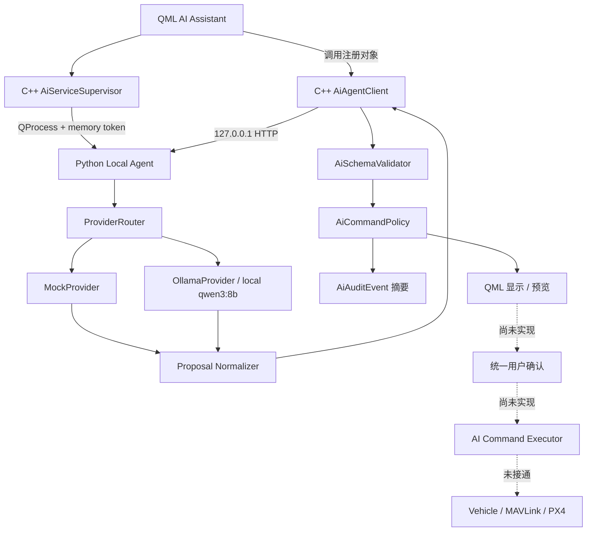

# 系统架构与安全链路

## 当前真实链路

## 分层核对

| 层 | 职责 / 输入 / 输出 | 代码路径 | 状态与联调 | 真实飞机与安全边界 |
| --- | --- | --- | --- | --- |
| QGC QML UI | 收集文本和只读 Vehicle 摘要；显示 reply/proposal | [`MerivusAIAssistantPanel.qml`](../../custom/res/Merivus/MerivusAIAssistantPanel.qml) | 已实现；本次仅静态核对，历史构建/GUI 证据需区分 | 不直接网络请求；本地规则的“执行”函数也只输出未执行提示 |
| C++ AI Client | 构造 HTTP 请求、超时/取消、解析响应、本地校验 | [`AiAgentClient.cc`](../../custom/src/Ai/AiAgentClient.cc) | 已实现；历史联调，本次未运行 | 没有 Vehicle/MAVLink/Swarm 执行引用 |
| Agent Supervisor | 启停打包/开发 Agent、健康轮询、重启、Token | [`AiServiceSupervisor.cc`](../../custom/src/Ai/AiServiceSupervisor.cc) | 已实现；本次未做 GUI 生命周期测试 | 只管理自己的本机进程，不 kill 未知端口进程 |
| Local Agent HTTP | health/info/chat，校验请求，路由 Provider | [`agent/app/main.py`](../../agent/app/main.py) | 已实现；本次单元测试通过，未启动真实服务 | 默认绑定 `127.0.0.1`；不包含飞控接口 |
| Provider | Mock 确定性回复；Ollama 本地模型 HTTP | [`agent/app/providers`](../../agent/app/providers/) | Mock/Ollama 已实现；真实 Ollama 本次未运行 | Provider 只返回 reply/proposal，不授予策略或执行权限 |
| 输出规范化 | 从模型文本/JSON 中提取并收敛 proposal | [`proposal_normalizer.py`](../../agent/app/proposal_normalizer.py) | 已实现；相关单元测试本次通过 | 不能把不稳定模型输出变成执行授权 |
| Schema 校验 | 拒绝形状、字段、深度、危险结构和参数错误 | [`AiSchemaValidator.cc`](../../custom/src/Ai/AiSchemaValidator.cc)、[`schemas`](../../schemas/) | 已实现；Python/JSON 本次验证，C++ 本次未跑 | 失败时默认 `Deny` / `Critical` |
| Command Policy | 固定枚举、参数约束、本地风险与决策 | [`AiCommandPolicy.cc`](../../custom/src/Ai/AiCommandPolicy.cc) | 已实现；历史 `27/0`，本次仅静态核对 | 飞行动作 `PreviewOnly` 或 `Deny`；`executable=false` |
| 用户确认 | 目标是高风险动作的明确确认与前置条件检查 | 当前 AI proposal 路径无独立实现 | **尚未实现/未接入** | 不能据此声称白名单和确认已连接执行层 |
| 飞行执行层 | 目标是受控调用 Vehicle/Mission/MAVLink | AI 路径无 Executor；非 AI 入口见 `CommandCenterOverlay`、`FlyViewMap`、`SwarmController` | AI 链路不存在；非 AI 路径真实存在，需独立审计 | 当前不允许 AI 连接；真实操作不得自动测试 |

## 专项安全结论

- **QML 是否直接访问网络：否。** AI QML 中仅保存 loopback 地址并调用 C++ 注册对象，未找到 `XMLHttpRequest`/WebSocket/fetch。
- **API Key 是否进入 QML 或仓库：定向审计未找到 MERIVUS 项目凭据。** `agent/.env.example` 的 Token 为空；本结论不是对全部上游/二进制文件的完整秘密扫描，真实值仍禁止提交。
- **Agent 是否默认关闭外部网络：默认关闭，但 Python 直接启动路径没有形成强制封锁。** 默认 Provider 是 Mock，默认监听地址和 Ollama 地址均为 loopback；QGC Supervisor 会强制 Ollama URL 为 `127.0.0.1/localhost`。然而 Python 配置只特判 `0.0.0.0`，其他非 loopback host 与任意 `MERIVUS_OLLAMA_BASE_URL` 仍可能由环境变量传入，同时 info 仍报告 `external_network_enabled=false`。这是高优先级配置语义风险，不能把“默认”写成“所有启动方式都强制”。
- **飞行执行是否默认关闭：是。** `/merivus/info` 返回 `flight_execution_enabled=false`，C++ `ActionProposal.executable` 固定为 false，QML 无执行入口。
- **LLM 是否只生成意图：是。** Provider 输出只有 `reply` 和可选 `proposal`；风险、确认需求和可执行性由 QGC 本地重算。
- **白名单/用户确认是否真正接入执行链：否。** 白名单/Policy 已实现，但统一用户确认与 Executor 尚未实现，因此链路停在显示/预览。
- **是否存在真实 MAVLink 实现：仓库存在 QGC 原生与 MERIVUS 非 AI 的 Vehicle/Mission/Swarm 实现；AI 链路没有对应执行映射。** 不得混淆这两类事实。

详细契约见 [接口契约](../architecture/INTERFACE_CONTRACTS.md)、[安全边界](../architecture/SAFETY_BOUNDARIES.md) 和 [AI Intent Policy](../architecture/AI_INTENT_POLICY.md)。
