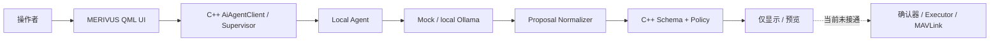

# MERIVUS 工程交接入口

更新时间：2026-08-19
本轮审计基线：`9bb0807`（整理开始时的 `origin/main`）
集成分支：`main`；开发改动通过短期功能分支和 PR 进入主分支

## 一页结论

MERIVUS 是基于 QGroundControl Custom Build 的多无人机调度地面站研发项目。当前版本是 `0.1.0-dev.1` 开发测试初版：QGC 定制 UI、本机 Python Agent、Mock/Ollama Provider、C++ Agent Client/Supervisor、`ActionProposal`、Schema/Policy 和 Windows 打包脚本均已进入仓库；AI 链路当前只回答、解释和展示结构化建议，**没有连接 Vehicle、MAVLink、PX4 或 Swarm 的 AI 执行器**。

项目正处于“阶段初版已收口，转入安全收敛和可重复验证”的阶段，不是生产版本。当前唯一优先任务是：**在不接真实飞机的前提下，对 QGC 非 AI 高风险执行入口（`CommandCenterOverlay`、`FlyViewMap`、`SwarmController`）建立统一清单、可见确认边界和 Mock/SITL 回归基线**。六机人工编队与 Shift 临时任务已按 2026-07-29 产品决策改为默认启用；AI 飞行动作仍默认关闭。详见 [下一步](09_NEXT_STEPS.md)。

## 当前基线

| 项目 | 结论 | 证据 |
| --- | --- | --- |
| 产品阶段 | `0.1.0-dev.1` 开发测试初版 | [`custom/custom.pri`](../../custom/custom.pri)、[阶段说明](../releases/0.1.0-dev.1.md) |
| 集成策略 | `main` 为唯一长期集成分支 | 功能分支完成静态检查、轻量验证与 PR 审查后合并并删除 |
| 本轮整理基线 | `9bb0807` | 2026-08-19 整理开始时的 `origin/main` |
| 工作区状态 | 以 `git status --short` 和当前 PR 为准，不在长期文档中固化瞬时分支状态 | 每次交接重新执行状态检查 |
| 当前实测 | Agent `63 passed, 6 warnings`；Windows 环境检查和 JSON 解析通过 | [测试矩阵](07_TEST_AND_VERIFICATION_MATRIX.md) |
| 当前未实测 | QGC 完整构建、C++ Policy 测试、GUI/Agent 联调、Ollama 真模型、打包、SITL、MAVLink、实机 | [测试矩阵](07_TEST_AND_VERIFICATION_MATRIX.md) |

## 已完成或已落库概览

- MERIVUS QGC Custom Build 界面、多机/链路展示和 AI 悬浮面板。
- Python FastAPI Local Agent，含 Mock 与 Ollama Provider、输出规范化和评估样例。
- C++ `AiAgentClient`、`AiServiceSupervisor`、`ActionProposal`、`AiSchemaValidator`、`AiCommandPolicy`、`AiAuditEvent`。
- PyInstaller onedir spec 与 staging 脚本。
- AI proposal 的“只显示、不执行”安全封锁；本次静态核对未发现 AI 到真实执行层的调用。

“已落库”不等于“本次完整验证”。逐项状态与证据见 [当前状态](02_CURRENT_STATE.md)。

交接文档统一使用以下状态：**已完成**、**已验证**、**已实现但未完整验证**、**正在进行**、**规划中**、**已暂停/暂缓**、**已否决或被替代**、**无法从仓库确认**。没有测试产物或本次执行记录时，不因文件存在而标为“已验证”。

## 尚未完成概览

- AI 用户确认框架、Command Executor、真实 MAVLink/Vehicle 执行接入。
- 生产鉴权、云 Provider、MCP、Device Gateway、Cloud API、数据库、Web Console、Media Service。
- `WaypointSafetyService` / GIS Safety Service 的生产实现。
- 可重复的干净 Windows 构建、签名安装包、升级与发布流水线。
- 当前仓库证据可确认的完整 SITL、长期链路和真实飞机验证。

## 不可违反的安全边界

- 不自动连接或控制真实飞机，不自动修改 PX4/RTK 参数，不连接厂商生产服务。
- LLM/Agent 不直接发送 MAVLink；proposal 不代表执行成功。
- 外部网络、云 Provider 与 AI 飞行执行默认关闭；密钥不得进入 QML、仓库或日志。
- 不把 QGC 原生/定制人工飞行入口误认为 AI 已接通执行层；两者必须分开审计。
- 真实飞行测试只能由人工按现场安全流程授权并执行，Codex 只记录结果。

## 推荐阅读顺序

1. 仓库根目录 [`AGENTS.md`](../../AGENTS.md)
2. 本文件
3. [当前真实状态](02_CURRENT_STATE.md)
4. [系统架构](03_SYSTEM_ARCHITECTURE.md)
5. [工程决策与历史](05_DECISIONS_AND_HISTORY.md)
6. [测试与验证矩阵](07_TEST_AND_VERIFICATION_MATRIX.md)
7. [下一步](09_NEXT_STEPS.md)
8. 与任务相关的原有详细文档

## 现有文档导航与可信度

| 文档组 | 推荐入口 | 审计标记 |
| --- | --- | --- |
| 项目/当前状态 | [项目总览](../architecture/PROJECT_OVERVIEW.md)、[当前状态](../architecture/CURRENT_STATE.md) | 当前有效，但其中“已验证”应结合本测试矩阵区分历史与本次结果 |
| AI/Agent 架构 | [QGC Agent Client](../architecture/QGC_AGENT_CLIENT.md)、[Agent Supervisor](../architecture/AGENT_SUPERVISOR.md)、[AI Intent Policy](../architecture/AI_INTENT_POLICY.md) | 当前主要实现一致 |
| 目标架构 | [目标架构](../architecture/TARGET_ARCHITECTURE.md)、[接口契约](../architecture/INTERFACE_CONTRACTS.md) | 部分过时；早期“QML 通信/仅 Mock”描述已被当前代码替代 |
| AI Assistant 使用说明 | [AI Assistant](../MERIVUS_AI_ASSISTANT.md) | **部分过时**：仍称确认后调用 `Vehicle` 且示例使用旧 `intent` 契约；当前代码只显示 `proposal`，不执行 |
| Agent 开发 | [Agent 开发](../development/AGENT_DEVELOPMENT.md) | 当前推荐入口 |
| `agent/README.md` | [`agent/README.md`](../../agent/README.md) | 部分过时：标题/正文仍称仅 Mock，且称 QProcess Token 未实现 |
| Windows 构建 | [Windows 构建](../development/BUILD_WINDOWS.md) | 当前入口；脚本默认路径依赖本机布局 |
| 发布记录 | [`0.1.0-dev.1`](../releases/0.1.0-dev.1.md)、[CHANGELOG](../releases/CHANGELOG.md) | 历史验证证据，不自动代表当前 HEAD 已复测 |
| 硬件 | [硬件索引](../hardware/README.md)、[7 寸原型](../hardware/AIRFRAME_7INCH_PROTOTYPE.md) | 需要实物/厂商资料核对；大量项目明确为估算或待测 |
| Archive | [`docs/archive`](../archive/) | 历史归档，不作为当前命令入口 |
| Templates | [`feature-brief`](../templates/feature-brief.md)、[`safety-review`](../templates/safety-review.md)、[`ui-review`](../templates/ui-review.md) | 当前可复用模板 |

## 本套文档

- [项目概述](01_PROJECT_OVERVIEW.md)
- [当前状态](02_CURRENT_STATE.md)
- [系统架构](03_SYSTEM_ARCHITECTURE.md)
- [组件与代码地图](04_COMPONENT_AND_CODE_MAP.md)
- [工程决策与历史](05_DECISIONS_AND_HISTORY.md)
- [环境、构建与运行](06_ENVIRONMENT_BUILD_AND_RUN.md)
- [测试与验证矩阵](07_TEST_AND_VERIFICATION_MATRIX.md)
- [风险与已知问题](08_RISKS_KNOWN_ISSUES.md)
- [下一步](09_NEXT_STEPS.md)
- [AI / Codex 接手说明](10_AI_CODEX_HANDOFF.md)
- [账号与电脑迁移](11_ACCOUNT_AND_MACHINE_MIGRATION.md)

## 生成依据

按“当前代码/配置 → Git 状态与历史 → 本次测试 → 一致的现有文档 → 历史归档”的顺序审计。主要依据为 `custom/src/Ai/`、`custom/res/Merivus/`、`agent/`、`schemas/`、`configs/`、`tools/dev/`、当前 Git 分支/标签/提交，以及 2026-07-20 实际执行的轻量验证。无法确认的内容均标为待确认、历史证据或尚未执行。
